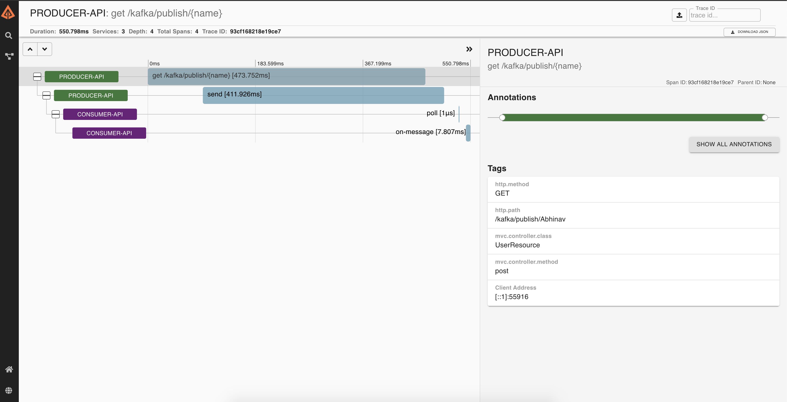

= spring-boot-kafka-example

== Applications

* *producer*
+
`Spring Boot` Web Java application that creates message and pushes topic in `Kafka`.

* *consumer*
+
`Spring Boot` Web Java application that consumes message from topic in `Kafka`.

== Start Environment

* Open a terminal and inside `kafka` root folder run
+
[source]
----
docker-compose up -d
----

* Wait a until all containers are Up (healthy). You can check their status by running
+
[source]
----
docker-compose ps
----

== Running Applications with Gradle

Inside `kafka` root folder, run the following `Gradle` commands in different terminals

* *eureka-server*
+
[source]
----
./gradlew :eureka-server:clean build
----

* *producer*
+
[source]
----
./gradlew :producer:clean build
----

* *consumer*
+
[source]
----
./gradlew :consumer:clean build
----

== Running Applications as Docker containers

=== Build Application's Docker Image

* In a terminal, make sure you are in `kafka` root folder

* In order to build the applications docker images, run the following script
+
[source]
----
./build-apps.sh
----

=== Application's Environment Variables

* *producer*
+
|===
|Environment Variable | Description

|`KAFKA_HOST`
|Specify host of the `Kafka` message broker to use (default `localhost`)

|`KAFKA_PORT`
|Specify port of the `Kafka` message broker to use (default `29092`)

|`EUREKA_HOST`
|Specify host of the `Eureka` service discovery to use (default `localhost`)

|`EUREKA_PORT`
|Specify port of the `Eureka` service discovery to use (default `8761`)

|`ZIPKIN_HOST`
|Specify host of the `Zipkin` distributed tracing system to use (default `localhost`)

|`ZIPKIN_PORT`
|Specify port of the `Zipkin` distributed tracing system to use (default `9411`)

|===

* *consumer*
+
|===
|Environment Variable | Description

|`KAFKA_HOST`
|Specify host of the `Kafka` message broker to use (default `localhost`)

|`KAFKA_PORT`
|Specify port of the `Kafka` message broker to use (default `29092`)

|`EUREKA_HOST`
|Specify host of the `Eureka` service discovery to use (default `localhost`)

|`EUREKA_PORT`
|Specify port of the `Eureka` service discovery to use (default `8761`)

|`ZIPKIN_HOST`
|Specify host of the `Zipkin` distributed tracing system to use (default `localhost`)

|`ZIPKIN_PORT`
|Specify port of the `Zipkin` distributed tracing system to use (default `9411`)

|===

=== Start Application's Docker Container

* In a terminal, make sure you are inside `kafka` root folder

* Run following script
+
[source]
----
./start-apps.sh
----

== Applications URLs

|===
|Application |URL

|producer
|http://localhost:9080/swagger-ui.html

|===

== Shutdown

* Stop applications
** If they were started with `Gradle`, go to the terminals where they are running and press `Ctrl+C`
** If they were started as a Docker container, run the script below
+
[source]
----
./stop-apps.sh
----

* Stop and remove docker-compose containers, networks and volumes
+
[source]
----
docker-compose down -v
----

== Useful links

* *Eureka*
+
`Eureka` can be accessed at http://localhost:8761

* *Kafka Topics UI*
+
`Kafka Topics UI` can be accessed at http://localhost:8085

* *Zipkin*
+
`Zipkin` can be accessed at http://localhost:9411
+
The figure below shows an example of the complete flow a request passes through. It goes since `producer-api`, where the message is created, until `consumer-api`.
+

* *Kafka Manager*
+
`Kafka Manager` can be accessed at http://localhost:9000
+

+
*Configuration*
+
- First, you must create a new cluster. Click on `Cluster` (dropdown button on the header) and then on `Add Cluster`
- Type the name of your cluster in `Cluster Name` field, for example: `MyZooCluster`
- Type `zookeeper:2181` in `Cluster Zookeeper Hosts` field
- Enable checkbox `Poll consumer information (Not recommended for large # of consumers if ZK is used for offsets tracking on older Kafka versions)`
- Click on `Save` button at the bottom of the page.

